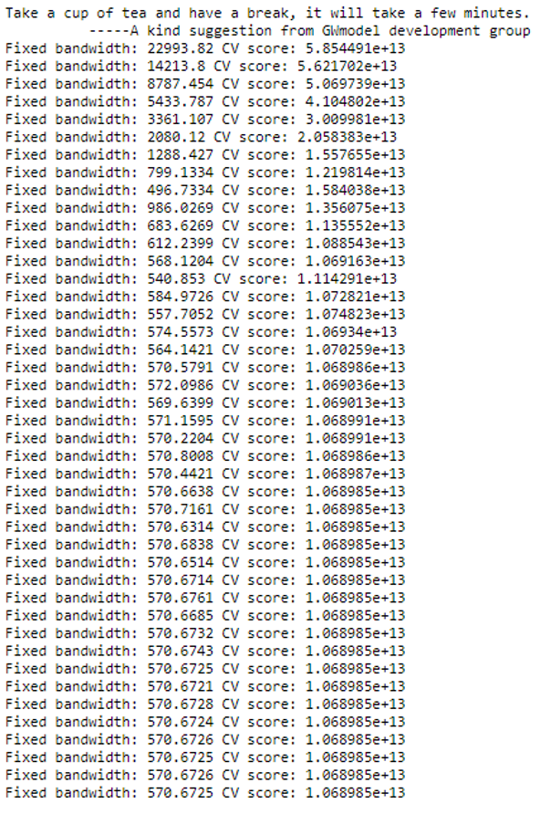
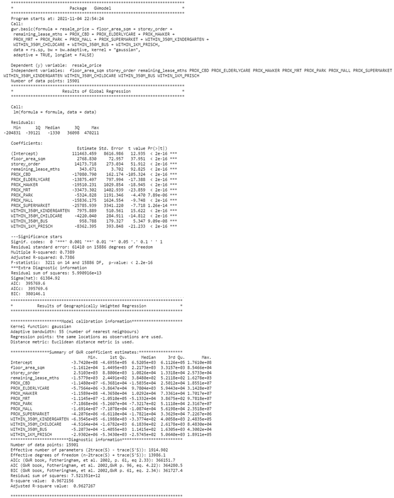

```{r setup, include=FALSE}
knitr::opts_chunk$set(echo = FALSE)
```


# 1. Background Information

- Housing is an essential component of household wealth worldwide. 
- Buying a housing has always been a major investment for most people. 
- The price of housing is affected by many factors. 
  - Some of them are global in nature such as the general economy of a country or inflation rate. 
  - Others can be more specific to the properties themselves. 
    - These factors can be further divided to structural and locational factors. 
- **Structural factors** are variables related to the property themselves such as the size, fitting, and tenure of the property. 
- **Locational factors** are variables related to the neighbourhood of the properties such as proximity to childcare centre, public transport service and shopping centre.

**Hedonic pricing model** is used to examine the effect of housing factors as discussed above on the price. 

- Conventional, this model was built by using Ordinary Least Square (OLS) method. 
- However, this method failed to take into consideration that spatial autocorrelation and spatial heterogeneity exist in geographic data sets such as housing transactions. 
- With the existence of spatial autocorrelation, the OLS estimation of hedonic pricing models could lead to biased, inconsistent, or inefficient results (Anselin 1998). 
- In view of this limitation, **Geographical Weighted Regression (GWR)** was introduced for calibrating hedonic price model for housing.

# 2. Objective of analysis

In this take-home exercise, I will build hedonic pricing models to explain factors affecting the resale prices of public housing in Singapore. The hedonic price models will be built by using appropriate GWR methods.

# 3. Datasets

- **Aspatial dataset**: 
  - HDB Resale data: a list of HDB resale transacted prices in Singapore from Jan 2017 onwards. It is in csv format which can be downloaded from Data.gov.sg.
- **Geospatial dataset**:
  - *MP14_SUBZONE_WEB_PL*: a polygon feature data providing information of URA 2014 Master Plan Planning Subzone boundary data. It is in ESRI shapefile format. This data set was also downloaded from Data.gov.sg
  
- **Locational factors with geographic coordinates**:
  - Downloaded from **Data.gov.sg**.
    - **Eldercare** data is a list of eldercare in Singapore. It is in shapefile format. 
    - **Hawker Centre** data is a list of hawker centres in Singapore. It is in geojson format.
    - **Parks** data is a list of parks in Singapore. It is in geojson format. 
    - **Supermarket** data is a list of supermarkets in Singapore. It is in geojson format. 
    - **CHAS clinics** data is a list of CHAS clinics in Singapore. It is in geojson format.
    - **Childcare service** data is a list of childcare services in Singapore. It is in geojson format. 
    - **Kindergartens** data is a list of kindergartens in Singapore. It is in geojson format. 
  - Downloaded from **Datamall.lta.gov.sg**.
    - **MRT** data is a list of MRT/LRT stations in Singapore with the station names and codes. It is in shapefile format.  
    - **Bus stops** data is a list of bus stops in Singapore. It is in shapefile format.
    
- **Locational factors without geographic coordinates**:
  - Downloaded from **Data.gov.sg**.
    - **Primary school** data is extracted from the list on General information of schools from data.gov portal. It is in csv format.
  - Retrieved/Scraped from **other sources**
    - **CBD** coordinates obtained from Google. 
    - **Shopping malls** data is a list of Shopping malls in Singapore obtained from [Wikipedia](https://en.wikipedia.org/wiki/List_of_shopping_malls_in_Singapore).
    - **Good primary schools** is a list of primary schools that are ordered in ranking in terms of popularity and this can be found at [Local Salary Forum](https://www.salary.sg/2021/best-primary-schools-2021-by-popularity).


# 4. Install and Load R packages 

This code chunk performs 3 tasks:

- A list called packages will be created and will consists of all the R packages required to accomplish this exercise.
- Check if R packages on package have been installed in R and if not, they will be installed.
- After all the R packages have been installed, they will be loaded.

```{r echo=TRUE, eval=TRUE}
packages <- c('sf', 'tidyverse', 'tmap', 'httr', 'jsonlite', 'rvest', 
              'sp', 'ggpubr', 'corrplot', 'broom',  'olsrr', 'spdep', 
              'GWmodel', 'devtools')
for(p in packages){
  if(!require(p, character.only = T)){
    install.packages(p)
  }
  library(p, character.only = T)
}
```

```{r echo=TRUE, eval=TRUE}
devtools::install_github("gadenbuie/xaringanExtra")
library(xaringanExtra)
```

```{r panelset, echo=FALSE}
xaringanExtra::use_panelset()
```


More on the packages used:

- **sf**: used for importing, managing, and processing **geospatial** data
  - specifically **vector-based** geospatial data
- **tidyverse**: used for importing, wrangling and visualising data. It consists of a family of R packages, such as:
  - **readr** for importing csv data,
  - **readxl** for importing Excel worksheet,
  - **tidyr** for manipulating data,
  - **dplyr** for transforming data, and
  - **ggplot2** for visualising data
- **tmap**: provides functions for plotting cartographic **quality** *static* point patterns maps or *interactive* maps by using leaflet API.
- **httr**: Useful tools for working with HTTP organised by HTTP verbs (GET(), POST(), etc). Configuration functions make it easy to control additional request components (authenticate(), add_headers() and so on).
  - In this analysis, it will be used to send GET requests to OneMapAPI SG to retrieve the coordinates of addresses.
- **jsonlite**: A simple and robust JSON parser and generator for R. It offers simple, flexible tools for working with JSON in R, and is particularly powerful for building pipelines and interacting with a web API. 
- **rvest**: A new package that makes it easy to scrape (or harvest) data from html web pages, inspired by libraries like beautiful soup.
  - In this analysis, it will be used to scrape data for **Shopping malls** and **Good primary schools**
- **sp**: provides classes and methods for dealing with spatial data in R.  

- **ggpubr**:  provides some easy-to-use functions for creating and customizing ggplot2 based publication ready plots
  - In this analysis, it will be used to arrange multiple ggplots. 
- **corrplot**: For Multivariate data visualisation and analysis
- **broom**: Takes the messy output of built-in functions in R, such as lm, nls, or t.test, and turns them into tidy tibble.
  - In this analysis, functions like tidy and glance will be used to construct a tibble / summmary of the model which is easier to look at.
- **oslrr**:  Used to build OLD and performing diagnostic tests. 
- **spdep**: For spatial dependence statistics.
- **GWmodel**: Calibrate geographical weighted family of modes.
- **devtools**: used for installing any R packages which is not available in RCRAN. In this exercise, I will be installing using devtools to install the package **xaringanExtra** which is still under development stage. 
- **xaringanExtra**: is an enhancement of xaringan package. As it is still under development stage, we can still install the current version using install_github function of devtools. This package will be used to add Panelsets to contain both the r code chunk and results whereever applicable.


# 5. Importing and Wrangling of Aspatial data

- *read_csv()* function of **readr** package is used to import resale-flat-prices into R as a tibble data frame called `resale`
- *glimpse()* function of **dplyr** package is used to display the data structure

::::: {.panelset}
::: {.panel}
## Code Chunk {.panel-name}
```{r echo=TRUE, eval=FALSE}
resale <- read_csv("data/aspatial/resale-flat-prices.csv")
```
:::
::: {.panel}
## Glimpse {.panel-name}
```{r echo=TRUE, eval=FALSE}
glimpse(resale)
```
:::
:::::

When we load in the dataset for the first time, we can see that:

- The dataset contains 11 columns with 110,893 rows. 
- The columns that are present in the data are: `month`, `town`, `flat_type`, `block`, `street_name`, `storey_range`, `floor_area_sqm`, `flat_model`, `lease_commence_date`, `remaining_lease`, `resale_price`. 
- As we are only interested in **four-room flat transactions** during the transaction period from **1st January 2019 to 30th September 2020**, we will be filtering this dataframe in the next part.

## 5.1 Filter resale data

Here, we use:

  - *filter()* function of **dplyr** package to select our desired **`flat_type`** and dates store it in **`rs_subset`**
  - *unique()* function of **base R** package to check whether **`flat_type`** and **`month`** have been extracted successfully

::::: {.panelset}
::: {.panel}
## Code Chunk {.panel-name}
```{r echo=TRUE, eval=FALSE}
rs_subset <-  filter(resale,flat_type == "4 ROOM") %>% 
              filter(month >= "2019-01" & month <= "2020-09")
```
:::
::: {.panel}
## Glimpse {.panel-name}
```{r echo=TRUE, eval=FALSE}
glimpse(rs_subset)
```
:::
::: {.panel}
## Unique month {.panel-name}
```{r echo=TRUE, eval=FALSE}
unique(rs_subset$month)
```
:::
::: {.panel}
## Unique flat_type {.panel-name}
```{r echo=TRUE, eval=FALSE}
unique(rs_subset$flat_type)
```
:::
:::::


From the results above, we can see that: 

- From Jan 2019 to September 2020, there are **15901 transactions** for four-room flat in Singapore.
- We have also correctly extracted the relevant **`month`** and **`flat_type`**.

## 5.2 Transform resale data
### 5.2.1 Create new columns

Here, we use *mutate* function of **dplyr** package to create columns such as:

- **`address`**: concatenation of the **`block`** and **`street_name`** columns using *paste()* function of **base R** package
- **`remaining_lease_yr`** & **`remaining_lease_mth`**: split the **year** and **months** part of the **`remaining_lease`** respectively using *str_sub()* function of **stringr** package then converting the character to integer using *as.integer()* function of **base R** package
- After performing mutate function, we will store the new data in **`rs_transform`**

::::: {.panelset}
::: {.panel}
## Code Chunk {.panel-name}
```{r echo=TRUE, eval=FALSE}
rs_transform <- rs_subset %>%
  mutate(rs_subset, address = paste(block,street_name)) %>%
  mutate(rs_subset, remaining_lease_yr = as.integer(str_sub(remaining_lease, 0, 2))) %>%
  mutate(rs_subset, remaining_lease_mth = as.integer(str_sub(remaining_lease, 9, 11)))
```
:::
::: {.panel}
## Head {.panel-name}
```{r echo=TRUE, eval=FALSE}
head(rs_transform)
```
:::
:::::


### 5.2.2 Sum up remaining lease in months 

In the code chunk below, we will:

- Replace NA values in **`remaining_lease_mth`** with the value 0 with the help of *is.na()* function of **base R** package
- Multiply **`remaining_lease_yr`** by 12 to convert it to months unit
- Create **`remaining_lease_mths`** column using *mutate* function of **dplyr** package which contains the summation of the **`remaining_lease_yr`** and **`remaining_lease_mths`** using *rowSums()* function of **base R** package
- Select required columns for analysis using *select()* function of **base R** package 

::::: {.panelset}
::: {.panel}
## Code Chunk {.panel-name}
```{r echo=TRUE, eval=FALSE}
rs_transform$remaining_lease_mth[is.na(rs_transform$remaining_lease_mth)] <- 0
rs_transform$remaining_lease_yr <- rs_transform$remaining_lease_yr * 12
rs_transform <- rs_transform %>% 
  mutate(rs_transform, remaining_lease_mths = rowSums(rs_transform[, c("remaining_lease_yr", "remaining_lease_mth")])) %>%
  select(month, town, address, block, street_name, flat_type, storey_range, floor_area_sqm, flat_model, 
         lease_commence_date, remaining_lease_mths, resale_price)
```
:::
::: {.panel}
## Head {.panel-name}
```{r echo=TRUE, eval=FALSE}
head(rs_transform)
```
:::
:::::


## 5.3 Retrieve Postal Codes and Coordinates of Addresses

This section will focus on retrieving the relevant data like postal codes and coordinates of the addresses which is required to get the proximity to locational factors later on. 


### 5.3.1 Create a list storing unique addresses

- We create a list to store unique addresses to ensure that we do not run the GET request more than what is necessary
- We can also sort it to make it easier for us to see at which address the GET request will fail. 
- Here, we use *unique()* function of **base R** package to extract the unique addresses then use *sort()* function of **base R** package to sort the unique vector.

```{r echo=TRUE, eval=FALSE}
add_list <- sort(unique(rs_transform$address))
```

### 5.3.2 Create function to retrieve coordinates from OneMap.Sg API

- 1. Firstly, we create a dataframe called **`postal_coords`** to store all the final retrieved coordinates
- 2. Secondly, we first use *GET()* function of **httr** package to make a GET request to *https://developers.onemap.sg/commonapi/search*
  - OneMap SG offers functions for us to query spatial data from the API in a tidy format and provides additional functionalities to allow easy data manipulation.
  - Here, we will be using their REST APIs to search address data for a given search value and retrieve the coordinates of the searched location.
  - The required variables to be included in the GET request is as follows:
    - **`searchVal`**: Keywords entered by user that is used to filter out the results.
    - **`returnGeom`** {Y/N}: Checks if user wants to return the geometry.
    - **`getAddrDetails`** {Y/N}: Checks if user wants to return address details for a point.
  - **Note**: 
    - The JSON response returned will contain multiple fields. 
    - However, we are only interested in the postal code and coordinates like Latitude & Longitude.
    - On their website, they also made an announcement on a minor text fix where they changed the word “LONGTITUDE” to “LONGITUDE” which we will be using the latter in this analysis.
- 3. We then create a dataframe `new_row` which will be used to store each final set of coordinates retrieved during the loop
- 4. We also need to check the number of responses returned and append to the main dataframe accordingly. This is because:
  - The no. of returned responses of the searched location, (indicated by variable `found`) , varies as some location might have only a single result while other locations might return multiple results. 
    - For example, the address **2 JLN BATU** returns 3 sets of postal codes and coordinates ( meaning `found` = 3). 
    - Hence, what we can do is to first look at only those that does not have empty postal codes then take the first set/row of the coordinates 
  - We can also check to see if the address is invalid by looking at the number of rows returned by request. 
  - There will also be some addresses searched that are invalid. ( means `found` = 0)
  - This step was helpful in determining what was causing the error of the API Call. We will see in the later section what errors was caused by the invalid searched errors.
- 5. Lastly, we will append the returned response (`new_row`) with the necessary fields to the main dataframe (`postal_coords`) using *rbind()* function of **base R** package.

```{r echo=TRUE, eval=FALSE}
get_coords <- function(add_list){
  
  # Create a data frame to store all retrieved coordinates
  postal_coords <- data.frame()
    
  for (i in add_list){
    #print(i)

    r <- GET('https://developers.onemap.sg/commonapi/search?',
           query=list(searchVal=i,
                     returnGeom='Y',
                     getAddrDetails='Y'))
    data <- fromJSON(rawToChar(r$content))
    found <- data$found
    res <- data$results
    
    # Create a new data frame for each address
    new_row <- data.frame()
    
    # If single result, append 
    if (found == 1){
      postal <- res$POSTAL 
      lat <- res$LATITUDE
      lng <- res$LONGITUDE
      new_row <- data.frame(address= i, postal = postal, latitude = lat, longitude = lng)
    }
    
    # If multiple results, drop NIL and append top 1
    else if (found > 1){
      # Remove those with NIL as postal
      res_sub <- res[res$POSTAL != "NIL", ]
      
      # Set as NA first if no Postal
      if (nrow(res_sub) == 0) {
          new_row <- data.frame(address= i, postal = NA, latitude = NA, longitude = NA)
      }
      
      else{
        top1 <- head(res_sub, n = 1)
        postal <- top1$POSTAL 
        lat <- top1$LATITUDE
        lng <- top1$LONGITUDE
        new_row <- data.frame(address= i, postal = postal, latitude = lat, longitude = lng)
      }
    }

    else {
      new_row <- data.frame(address= i, postal = NA, latitude = NA, longitude = NA)
    }
    
    # Add the row
    postal_coords <- rbind(postal_coords, new_row)
  }
  return(postal_coords)
}
```

### 5.3.3 Call **get_coords** function to retrieve resale coordinates 
```{r echo=TRUE, eval=FALSE}
coords <- get_coords(add_list)
```

### 5.3.4 Inspect results 

- Here, we check whether the relevant columns contains any NA values with *is.na()* function of **base R** package and also "NIL".

```{r echo=TRUE, eval=FALSE}
coords[(is.na(coords$postal) | is.na(coords$latitude) | is.na(coords$longitude) | coords$postal=="NIL"), ]
```

From the results above, we can see that:

- There are 2 addresses that does not contain any postal codes but contains the geographic coordinates: 
  - 215 CHOA CHU KANG CTRL
  - 216 CHOA CHU KANG CTRL
  - When researched further, according to **gothere.sg** website, it seems like these 2 addresses have their respective postal codes: 
    - 680215 
    - 680216 
  - However, as OneMapAPISG returned the same set of coordinates for both of these addresses, we shall proceed with keeping them as we are more interested in the coordinates for our analysis later on. 
- Additionally, other addresses that contains the string **"ST.GEORGE'S RD"** have NA for the geographic coordinates. 
  - With further testing, it seems like we have to change **ST. GEORGE to SAINT GEORGE** for OneMapAPISG to return the correct geographic coordinates for these addresses.
  - Hence, we will combine the successfully retrieved coordinates first and handle the invalid addresses separately. 
  
  
### 5.3.5 Combine resale and coordinates data 

- After retrieving the coordinates, we should combine the successful ones with our transformed resale dataset.
- We can do this using *left_join()* function of **dplyr** package and our data will be stored in `rs_coords`. 

::::: {.panelset}
::: {.panel}
## Code Chunk {.panel-name}
```{r echo=TRUE, eval=FALSE}
rs_coords <- left_join(rs_transform, coords, by = c('address' = 'address'))
```
:::
::: {.panel}
## Head {.panel-name}
```{r echo=TRUE, eval=FALSE}
head(rs_coords)
```
:::
:::::


### 5.3.6 Handle invalid addresses
#### 5.3.6.1 Replace sub string in invalid addresses in **`address`** column & extract to new DF

- *sub()* function of **base R** package is used to change **ST. GEORGE** to **SAINT GEORGE** 
- *grepl()* function of **base R** package is used to extract rows with addresses containing  **SAINT GEORGE'S** 

::::: {.panelset}
::: {.panel}
## Code Chunk {.panel-name}
```{r echo=TRUE, eval=FALSE}
rs_coords$address <- sub("ST. GEORGE'S", "SAINT GEORGE'S", rs_coords$address)
rs_invalid <- rs_coords[grepl("SAINT GEORGE'S", rs_coords$address), ]
```
:::
::: {.panel}
## Glimpse {.panel-name}
```{r echo=TRUE, eval=FALSE}
glimpse(rs_invalid)
```
:::
:::::


From the results above, we can see that:

- There are **27** rows that contains **"ST. GEORGE'S"** as the **`street_name`** but has the substring replaced in the **`address`** column. 

#### 5.3.6.2 Create unique list of addresses again
```{r echo=TRUE, eval=FALSE}
add_list <- sort(unique(rs_invalid$address))
```

#### 5.3.6.3 Call get_coords to retrieve resale coordinates again
```{r echo=TRUE, eval=FALSE}
rs_invalid_coords <- get_coords(add_list)
```

#### 5.3.6.4 Inspect results again

- Here, we check whether the relevant columns contains any NA values with *is.na()* function of **base R** package.

```{r echo=TRUE, eval=FALSE}
rs_invalid_coords[(is.na(rs_invalid_coords$postal) | is.na(rs_invalid_coords$latitude) | is.na(rs_invalid_coords$longitude)), ]
```

#### 5.3.6.5 Combine rs_invalid_coords with rs_coords data 

- After retrieving the coordinates, we should combine it with our transformed resale dataset by performing a left join.
- We can do this using *left_join()* function of **dplyr** package. 

::::: {.panelset}
::: {.panel}
## Code Chunk {.panel-name}
```{r echo=TRUE, eval=FALSE}
rs_coords_final <- rs_coords %>%
  left_join(rs_invalid_coords, by = c("address")) %>%
  mutate(latitude = ifelse(is.na(postal.x), postal.y, postal.x)) %>%
  mutate(latitude = ifelse(is.na(latitude.x), latitude.y, latitude.x)) %>%
  mutate(longitude = ifelse(is.na(longitude.x), longitude.y, longitude.x)) %>%
  select(-c(postal.x, latitude.x, longitude.x, postal.y, latitude.y, longitude.y))
```
:::
::: {.panel}
## Head {.panel-name}
```{r echo=TRUE, eval=FALSE}
head(rs_coords_final)
```
:::
:::::


## 5.5 Write file to rds 

- As our subset resale dataset is now complete with the coordinates, we can now save it as an rds file.
- This also helps us to prevent running the GET request more than what is needed.

```{r echo=TRUE, eval=FALSE}
rs_coords_rds <- write_rds(rs_coords_final, "data/aspatial/rds/rs_coords.rds")
```

## 5.6 Read **`rs_coords`** RDS file

::::: {.panelset}
::: {.panel}
## Code Chunk {.panel-name}
```{r echo=TRUE, eval=FALSE}
rs_coords <- read_rds("data/aspatial/rds/rs_coords.rds")
```
:::
::: {.panel}
## Glimpse {.panel-name}
```{r echo=TRUE, eval=FALSE}
glimpse(rs_coords)
```
:::
:::::


### 5.6.1 Assign and Transform CRS and Check

- Since the coordinate columns are Latitude & Longitude which are in decimal degrees, the projected CRS will be WGS84.
- We will need to assign them the respective EPSG code 4326 first before transforming it to 3414 which is the EPSG code for SVY21.
- Here we use, 
  - *st_as_sf()* function of **sf** package to convert the data frame into sf object
  - *st_transform()* function of **sf** package to transform the coordinates of the sf object
  
::::: {.panelset}
::: {.panel}
## Code Chunk {.panel-name}
```{r echo=TRUE, eval=FALSE}
rs_coords_sf <- st_as_sf(rs_coords,
                    coords = c("longitude", 
                               "latitude"),
                    crs=4326) %>%
  st_transform(crs = 3414)
```
:::
::: {.panel}
## st_crs {.panel-name}
```{r echo=TRUE, eval=FALSE}
st_crs(rs_coords_sf)
```
:::
:::::

### 5.6.2 Check for invalid geometries
```{r echo=TRUE, eval=FALSE}
length(which(st_is_valid(rs_coords_sf) == FALSE))
```

### 5.6.3 Plot hdb resale points
```{r echo=TRUE, eval=FALSE}
tmap_mode("view")
tm_shape(rs_coords_sf)+
  tm_dots(col="blue", size = 0.02)
tmap_mode("plot")
```


# 6. Import Locational Factors data
## 6.1 Locational Factors with geographic coordinates
### 6.1.1 Read and check CRS of Locational factors 

Here we use, 

- *st_read* of **sf** package to read simple features or layers from file
- *st_crs* of **sf** package to retrieve the coordinate reference system from sf object

::::: {.panelset}
::: {.panel}
## Code Chunk {.panel-name}
```{r echo=TRUE, eval=FALSE}
elder_sf <- st_read(dsn = "data/idptvar", layer="ELDERCARE")
mrtlrt_sf <- st_read(dsn = "data/idptvar", layer="MRTLRTStnPtt")
bus_sf <- st_read(dsn = "data/idptvar", layer="BusStop")

hawker_sf <- st_read("data/idptvar/hawker-centres-geojson.geojson") 
parks_sf <- st_read("data/idptvar/parks-geojson.geojson") 
supermkt_sf <- st_read("data/idptvar/supermarkets-geojson.geojson") 
chas_sf <- st_read("data/idptvar/chas-clinics-geojson.geojson")
childcare_sf <- st_read("data/idptvar/child-care-services-geojson.geojson") 
kind_sf <- st_read("data/idptvar/kindergartens-geojson.geojson") 
```
:::
::: {.panel}
## Check CRS {.panel-name}
```{r echo=TRUE, eval=FALSE}
st_crs(elder_sf)
st_crs(mrtlrt_sf)
st_crs(bus_sf)
st_crs(hawker_sf)
st_crs(parks_sf)
st_crs(supermkt_sf)
st_crs(chas_sf)
st_crs(childcare_sf)
st_crs(kind_sf)
```
:::
:::::


From the results above, we can see that:

- The datasets with WGS84 as the Geodetic CRS are:
  - `childcare_sf`, `hawker_sf`, `kind_sf`, `parks_sf`, `supermkt_sf`, `chas_sf`
  - As the EPSG code are in 4326 which is the appropriate EPSG code for WGS 84, we will only need to transform the CRS later on.
- While the datasets with SVY21 as the Projected CRS are:
  - `elder_sf`, `mrtlrt_sf`, `busstop_sf`
  - However, for all of these datasets, the EPSG code is **9001** which is wrong since the correct code for **SVY21** should be **3414**.


### 6.1.2 Assign EPSG code to sf dataframes and check again

::::: {.panelset}
::: {.panel}
## Code Chunk {.panel-name}
```{r echo=TRUE, eval=FALSE}
elder_sf <- st_set_crs(elder_sf, 3414)
mrtlrt_sf <- st_set_crs(mrtlrt_sf, 3414)
bus_sf <- st_set_crs(bus_sf, 3414)

hawker_sf <- hawker_sf %>%
  st_transform(crs = 3414)
parks_sf <- parks_sf %>%
  st_transform(crs = 3414)
supermkt_sf <- supermkt_sf %>%
  st_transform(crs = 3414)
chas_sf <- chas_sf %>%
  st_transform(crs = 3414)
childcare_sf <- childcare_sf %>%
  st_transform(crs = 3414)
kind_sf <- kind_sf %>%
  st_transform(crs = 3414)
```
:::
::: {.panel}
## Check CRS {.panel-name}
```{r echo=TRUE, eval=FALSE}
st_crs(elder_sf)
st_crs(mrtlrt_sf)
st_crs(bus_sf)
st_crs(hawker_sf)
st_crs(parks_sf)
st_crs(supermkt_sf)
st_crs(chas_sf)
st_crs(childcare_sf)
st_crs(kind_sf)
```
:::
:::::

From the above results, we can see that the EPSG code of all the data has now been assigned correctly and they are all EPSG 3414.

### 6.1.3 Check for invalid geometries

- Since the datasets above have the appropriate EPSG and the geometries, we should also check for any invalid geometries so that there won't be any failure later on when we want to calculate the proximity or plot the map.
- Here, *st_is_valid()* of **sf** package is used to check for any invalid geometries.
- *length()* function of **base R** package is also used to get the count of invalid geometries if any. 

```{r echo=TRUE, eval=FALSE}
length(which(st_is_valid(elder_sf) == FALSE))
length(which(st_is_valid(mrtlrt_sf) == FALSE))
length(which(st_is_valid(hawker_sf) == FALSE))
length(which(st_is_valid(parks_sf) == FALSE))
length(which(st_is_valid(supermkt_sf) == FALSE))
length(which(st_is_valid(chas_sf) == FALSE))
length(which(st_is_valid(childcare_sf) == FALSE))
length(which(st_is_valid(kind_sf) == FALSE))
length(which(st_is_valid(bus_sf) == FALSE))
```

From the results above, we can see that there are no invalid geometries for all of the locational factors. 

### 6.1.4 Calculate Proximity
#### 6.1.4.1 Create **get_prox** function to calculate proximity 

- The following code chunk performs 3 steps:
  - 1. It will create a matrix of distances between the HDB and the locational factor using *st_distance* of **sf** package.
  - 2. It will also get the nearest point of the locational factor by looking at the minimum distance using *min* function of **base R** package then add it to HDB resale data under a new column using *mutate()* function of **dpylr** package. 
  - 3. Lastly, it will rename the column name according to input given by user so that the columns have appropriate and distinct names that are different from one another. 
  
```{r echo=TRUE, eval=FALSE}
get_prox <- function(origin_df, dest_df, col_name){
  
  # creates a matrix of distances
  dist_matrix <- st_distance(origin_df, dest_df)           
  
  # find the nearest location_factor and create new data frame
  near <- origin_df %>% 
    mutate(PROX = apply(dist_matrix, 1, function(x) min(x)) / 1000) 
  
  # rename column name according to input parameter
  names(near)[names(near) == 'PROX'] <- col_name

  # Return df
  return(near)
}
```

#### 6.1.4.2 Call **get_prox** function

- Here, we call the **get_prox** function created earlier to get the proximity of the resale HDB and locational factors such as:
  - Eldercare
  - MRT
  - Hawker
  - Parks
  - Supermarkets
  - CHAS clinics
- The proximity will then be created as a new column under the **`rs_coords_sf`** dataframe. 

```{r echo=TRUE, eval=FALSE}
rs_coords_sf <- get_prox(rs_coords_sf, elder_sf, "PROX_ELDERLYCARE") 
rs_coords_sf <- get_prox(rs_coords_sf, mrtlrt_sf, "PROX_MRT") 
rs_coords_sf <- get_prox(rs_coords_sf, hawker_sf, "PROX_HAWKER") 
rs_coords_sf <- get_prox(rs_coords_sf, parks_sf, "PROX_PARK") 
rs_coords_sf <- get_prox(rs_coords_sf, supermkt_sf, "PROX_SUPERMARKET")
rs_coords_sf <- get_prox(rs_coords_sf, chas_sf, "PROX_CHAS")
```

### 6.1.5 Create **get_within** function to calculate no. of factors within dist 

- The following code chunk performs 3 steps:
  - 1. It will create a matrix of distances between the HDB and the locational factor using *st_distance* of **sf** package.
  - 2. It will also get the sum of points of the locational factor that are within the `threshold distance` using *sum* function of **base R** package then add it to HDB resale data under a new column using *mutate()* function of **dpylr** package. 
  - 3. Lastly, it will rename the column name according to input given by user so that the columns have appropriate and distinct names that are different from one another. 
  
  
```{r echo=TRUE, eval=FALSE}
get_within <- function(origin_df, dest_df, threshold_dist, col_name){
  
  # creates a matrix of distances
  dist_matrix <- st_distance(origin_df, dest_df)   
  
  # count the number of location_factors within threshold_dist and create new data frame
  wdist <- origin_df %>% 
    mutate(WITHIN_DT = apply(dist_matrix, 1, function(x) sum(x <= threshold_dist)))
  
  # rename column name according to input parameter
  names(wdist)[names(wdist) == 'WITHIN_DT'] <- col_name

  # Return df
  return(wdist)
}
```

#### 6.1.5.1 Call **get_within** function 

- Here, we call the **get_within** function created earlier to get the number of locational factors that are within a certain threshold distance. 
- In this case, the threshold we set it to will be **Within 350m** for locational factors such as, Kindergartens, Childcare centres and Bus stops.

- Kindergarten

::::: {.panelset}
::: {.panel}
## Code Chunk {.panel-name}
```{r echo=TRUE, eval=FALSE}
rs_coords_sf <- get_within(rs_coords_sf, kind_sf, 350, "WITHIN_350M_KINDERGARTEN")
```
:::
::: {.panel}
## head {.panel-name}
```{r echo=TRUE, eval=FALSE}
head(rs_coords_sf)
```
:::
:::::

- Childcare centres

::::: {.panelset}
::: {.panel}
## Code Chunk {.panel-name}
```{r echo=TRUE, eval=FALSE}
rs_coords_sf <- get_within(rs_coords_sf, childcare_sf, 350, "WITHIN_350M_CHILDCARE")
```
:::
::: {.panel}
## head {.panel-name}
```{r echo=TRUE, eval=FALSE}
head(rs_coords_sf)
```
:::
:::::

- Bus stops

::::: {.panelset}
::: {.panel}
## Code Chunk {.panel-name}
```{r echo=TRUE, eval=FALSE}
rs_coords_sf <- get_within(rs_coords_sf, bus_sf, 350, "WITHIN_350M_BUS")
```
:::
::: {.panel}
## head {.panel-name}
```{r echo=TRUE, eval=FALSE}
head(rs_coords_sf)
```
:::
:::::


## 6.2 Locational Factors without geographic coordinates

In this section, we retrieve those locational factors that are not easily obtainable from data.gov.sg and/or does not have any geographic coordinates.

### 6.2.1 CBD

- So far, in our previous assignments, we know of the Planning Area called **Downtown Core**. However, this remains relatively unheard of by the public and the term Central Business District (CBD) is commonly used in conversation instead.
- Hence, with a quick Google search, the latitude and longitude of Downtown Core also known as CBD, are 1.287953 and 103.851784 respectively.
- As we already have the geographic coordinates of the resale data, we just need to convert the latitude and longitude of CBD area to EPSG 3414 (SVY21) format before we can run the **get_prox** function previously.
- We can first create a dataframe consisting of the latitude and longitude coordinates of the CBD area then transform it to EPSG 3414 (SVY21) format. 

#### 6.2.1.1 Store CBD coordinates in dataframe
```{r echo=TRUE, eval=FALSE}
name <- c('CBD Area')
latitude= c(1.287953)
longitude= c(103.851784)
cbd_coords <- data.frame(name, latitude, longitude)
```

#### 6.2.1.2 Assign and Transform CRS

- Here we use, 
  - *st_as_sf()* function of **sf** package to convert the data frame into sf object
  - *st_transform()* function of **sf** package to transform the coordinates of the sf object
  
::::: {.panelset}
::: {.panel}
## Code Chunk {.panel-name}
```{r echo=TRUE, eval=FALSE}
cbd_coords_sf <- st_as_sf(cbd_coords,
                    coords = c("longitude", 
                               "latitude"),
                    crs=4326) %>%
  st_transform(crs = 3414)
```
:::
::: {.panel}
## st_crs {.panel-name}
```{r echo=TRUE, eval=FALSE}
st_crs(cbd_coords_sf)
```
:::
:::::

- From the above results, we can see that the coordinates for CBD area in EPSG 3414 (SVY21) format is **c(30055.05, 30040.83)**.
- Hence, we can now run our **get_prox** function to calculate the proximity of HDB and CBD area.

#### 6.2.1.3 Call **get_prox** function

- Here, we call the **get_prox** function to get the proximity of HDB and CBD area.

```{r echo=TRUE, eval=FALSE}
rs_coords_sf <- get_prox(rs_coords_sf, cbd_coords_sf, "PROX_CBD") 
```


### 6.2.2 Shopping Malls

As there are currently no available datasets that we can download for Shopping Malls in Singapore, an **alternative** would be to extract the Shopping Mall names from [Wikipedia](https://en.wikipedia.org/wiki/List_of_shopping_malls_in_Singapore) and then get the respective coordinates with our **get_coords** function before computing the proximity. 

#### 6.2.2.1 Extract Shopping Malls from Wikipedia

- Since there are multiple lists of shopping malls classified by the regions in Singapore, we can check the XPaths of the various lists in the wikipedia page. The pattern identified here would be that the elements are unordered lists. 
- The path expressions used in the following code chunk are:
  - **[@attribute = 'value']**:	Select nodes with a particular attribute value
  - **/**:	A beginning single slash indicates a select from the root node, subsequent slashes indicate selecting a child node from current node
  - **text()**: Select the text content of a node
  - This is something additional that I have learnt during my own time. It might take some time to get use to dealing with scraping from web pages, but once you get the basics down, it is very useful in getting the data you need.
  - You can read more about it at [Library Carpentry](https://librarycarpentry.org/lc-webscraping/02-xpath/index.html)
- In a nutshell, the following code chunk will perform 3 steps:
  - 1. Read the Wikipedia html page containing the Shopping Malls in Singapore
  - 2. Read the text portion (html_text()) of the Unordered List element selected by html_nodes()
  - 3. Append it to the empty **`mall_list`** created

::::: {.panelset}
::: {.panel}
## Code Chunk {.panel-name}
```{r echo=TRUE, eval=FALSE}
url <- "https://en.wikipedia.org/wiki/List_of_shopping_malls_in_Singapore"
malls_list <- list()

for (i in 2:7){
  malls <- read_html(url) %>%
    html_nodes(xpath = paste('//*[@id="mw-content-text"]/div[1]/div[',as.character(i),']/ul/li',sep="") ) %>%
    html_text()
  malls_list <- append(malls_list, malls)
}
```
:::
::: {.panel}
## st_crs {.panel-name}
```{r echo=TRUE, eval=FALSE}
malls_list
```
:::
:::::

From the results above, we can see that:

- There are about 169 shopping malls extracted. 
- As these malls does not have the respective coordinates, we can use the **`get_coords`** function created previously to search the names of these shopping malls and retrieve them.

#### 6.2.2.2 Call get_coords function 

- We call the **`get_coords`** function to retrieve coordinates of Shopping Malls
- After calling the function, we will also rename the address to **`mall_name`** for easier reference

```{r echo=TRUE, eval=FALSE}
malls_list_coords <- get_coords(malls_list) %>% 
  rename("mall_name" = "address")
```

From the results above, we can see that:

- Some of the shopping mall names are not updated. For example,
  - **POMO** has been renamed to **GR.ID**
  - **OD Mall** has been renamed to **The Grandstand**
- Other shopping malls had minor issues where partial string of the Shopping Mall searched had successful responses. 
  - For example,
    - Instead of searching **Clarke Quay Central**, searching **Clarke Quay** was good enough
    - Similarly, instead of searching **City Gate Mall**, searching **City Gate** was good enough
- Only one of the shopping mall, **Yew Tee Shopping Centre**, when researched further, was not existent. 
  - Hence, we need to remove this row first.
- Also, in order for our analysis to be accurate as possible, we should fix all these issues first before moving forward. 

#### 6.2.2.3 Remove invalid Shopping Mall name
```{r echo=TRUE, eval=FALSE}
malls_list_coords <- subset(malls_list_coords, mall_name!= "Yew Tee Shopping Centre")
```

#### 6.2.2.4 Correct invalid mall names that can be found 
```{r echo=TRUE, eval=FALSE}
invalid_malls<- subset(malls_list_coords, is.na(malls_list_coords$postal))
invalid_malls_list <- unique(invalid_malls$mall_name)
corrected_malls <- c("Clarke Quay", "City Gate", "Raffles Holland V", "Knightsbridge", "Mustafa Centre", "GR.ID", "Shaw House",
                     "The Poiz Centre", "Velocity @ Novena Square", "Singapore Post Centre", "PLQ Mall", "KINEX", "The Grandstand")

for (i in 1:length(invalid_malls_list)) {
  malls_list_coords <- malls_list_coords %>% 
    mutate(mall_name = ifelse(as.character(mall_name) == invalid_malls_list[i], corrected_malls[i], as.character(mall_name)))
}
```

#### 6.2.2.5 Create a list storing unique mall names
```{r echo=TRUE, eval=FALSE}
malls_list <- sort(unique(malls_list_coords$mall_name))
```

#### 6.2.2.6 Call get_coords to retrieve coordinates of Shopping Malls again
```{r echo=TRUE, eval=FALSE}
malls_coords <- get_coords(malls_list)
```

#### 6.2.2.7 Inspect results

- Here, we check whether the relevant columns contains any NA values with *is.na()* function of **base R** package.

```{r echo=TRUE, eval=FALSE}
malls_coords[(is.na(malls_coords$postal) | is.na(malls_coords$latitude) | is.na(malls_coords$longitude)), ]
```

#### 6.2.2.8 Convert data frame into sf object, assign and transform CRS

- Here we use, 
  - *st_as_sf()* function of **sf** package to convert the data frame into sf object
  - *st_transform()* function of **sf** package to transform the coordinates of the sf object
  
```{r echo=TRUE, eval=FALSE}
malls_sf <- st_as_sf(malls_coords,
                    coords = c("longitude", 
                               "latitude"),
                    crs=4326) %>%
  st_transform(crs = 3414)
```

#### 6.2.2.9 Call **get_prox** function 

- Here, we call the get prox function to get proximity of **HDB and Shopping Malls**

```{r echo=TRUE, eval=FALSE}
rs_coords_sf <- get_prox(rs_coords_sf, malls_sf, "PROX_MALL") 
```


### 6.2.3 Primary Schools
#### 6.2.3.1 Read in CSV file

::::: {.panelset}
::: {.panel}
## Code Chunk {.panel-name}
```{r echo=TRUE, eval=FALSE}
pri_sch <- read_csv("data/idptvar/general-information-of-schools.csv")
```
:::
::: {.panel}
## Glimpse {.panel-name}
```{r echo=TRUE, eval=FALSE}
glimpse(pri_sch)
```
:::
:::::

#### 6.2.3.2 Extract Primary Schools and required columns only

::::: {.panelset}
::: {.panel}
## Code Chunk {.panel-name}
```{r echo=TRUE, eval=FALSE}
pri_sch <- pri_sch %>%
  filter(mainlevel_code == "PRIMARY") %>%
  select(school_name, address, postal_code, mainlevel_code)
```
:::
::: {.panel}
## Glimpse {.panel-name}
```{r echo=TRUE, eval=FALSE}
glimpse(pri_sch)
```
:::
:::::

From the results above, we can see that there are **183** Primary Schools in Singapore.

#### 6.2.3.3 Create list storing unique postal codes of Primary Schools
```{r echo=TRUE, eval=FALSE}
prisch_list <- sort(unique(pri_sch$postal_code))
```

#### 6.2.3.4 Call get_coords function to retrieve coordinates of Primary Schools
```{r echo=TRUE, eval=FALSE}
prisch_coords <- get_coords(prisch_list)
```

#### 6.2.3.5 Inspect results

- Here, we check whether the relevant columns contains any NA values with *is.na()* function of **base R** package.

```{r echo=TRUE, eval=FALSE}
prisch_coords[(is.na(prisch_coords$postal) | is.na(prisch_coords$latitude) | is.na(prisch_coords$longitude)), ]
```

#### 6.2.3.6 Combine coordinates with Primary School Names 

- Here, we combine the retrieved coordinates with the df that has the Primary School Names so that we can verify whether we have extracted it correctly. 
- We combine it using the *left_join* function of **dplyr** package

::::: {.panelset}
::: {.panel}
## Code Chunk {.panel-name}
```{r echo=TRUE, eval=FALSE}
prisch_coords = prisch_coords[c("postal","latitude", "longitude")]
pri_sch <- left_join(pri_sch, prisch_coords, by = c('postal_code' = 'postal'))
```
:::
::: {.panel}
## Head {.panel-name}
```{r echo=TRUE, eval=FALSE}
head(pri_sch)
```
:::
:::::

#### 6.2.3.7 Convert pri_sch data frame into sf object, assign and transform CRS

- Here we use, 
  - *st_as_sf()* function of **sf** package to convert the data frame into sf object
  - *st_transform()* function of **sf** package to transform the coordinates of the sf object
  
::::: {.panelset}
::: {.panel}
## Code Chunk {.panel-name}
```{r echo=TRUE, eval=FALSE}
prisch_sf <- st_as_sf(pri_sch,
                    coords = c("longitude", 
                               "latitude"),
                    crs=4326) %>%
  st_transform(crs = 3414)
```
:::
::: {.panel}
## st_crs {.panel-name}
```{r echo=TRUE, eval=FALSE}
st_crs(prisch_sf)
```
:::
:::::

#### 6.2.3.8 Call **get_within** function 

- Here, we call the **get_within** function to get no. of Primary Schools within threshold of 1km or 1000m to be exact.

::::: {.panelset}
::: {.panel}
## Code Chunk {.panel-name}
```{r echo=TRUE, eval=FALSE}
rs_coords_sf <- get_within(rs_coords_sf, prisch_sf, 1000, "WITHIN_1KM_PRISCH")
```
:::
::: {.panel}
## Head {.panel-name}
```{r echo=TRUE, eval=FALSE}
head(rs_coords_sf)
```
:::
:::::


### 6.2.4 Good Primary Schools (Top 10)

- As there are no datasets that we can download from public data portals, an alternative would be to extract the "good" primary schools from forums or other websites. 
- One particular forum that we can use is **www.salary.sg** where they provide a list of primary schools and rank them according to popularity. 
- Similar to how we used XPath expression to scrape data for Shopping Malls in Singapore from Wikipedia, we will also use XPaths here. 
- The difference is that here, the lists are ordered. Hence we have to change the ul to ol. 
- Also the attribute is id instead.  
- [Salary SG Forum](https://www.salary.sg/2021/best-primary-schools-2021-by-popularity/)
- In a nutshell, the following code chunk will perform 4 steps:
  - 1. Read the Salary Forum html page containing the Good Primary Schools in Singapore
  - 2. Read all the text portion (html_text()) of the Ordered List element selected by html_nodes()
  - 3. Minor data transformation
    - Converting the name to uppercase
    - Deleting the substring in primary school names containg **(PRIMARY SECTION)**
    - Trim whitespaces
  - 4. Appending the schools extracted to a dataframe called `good_pri` and selecting the top 10 into `top_good_pri` dataframe

#### 6.2.4.1 Extract Ranking List of Primary Schools

::::: {.panelset}
::: {.panel}
## Code Chunk {.panel-name}
```{r echo=TRUE, eval=FALSE}
url <- "https://www.salary.sg/2021/best-primary-schools-2021-by-popularity/"

good_pri <- data.frame()

schools <- read_html(url) %>%
  html_nodes(xpath = paste('//*[@id="post-3068"]/div[3]/div/div/ol/li') ) %>%
  html_text() 

for (i in (schools)){
  sch_name <- toupper(gsub(" – .*","",i))
  sch_name <- gsub("\\(PRIMARY SECTION)","",sch_name)
  sch_name <- trimws(sch_name)
  new_row <- data.frame(pri_sch_name=sch_name)
  # Add the row
  good_pri <- rbind(good_pri, new_row)
}

top_good_pri <- head(good_pri, 10)
```
:::
::: {.panel}
## Head {.panel-name}
```{r echo=TRUE, eval=FALSE}
head(top_good_pri)
```
:::
:::::


#### 6.2.4.2 Check for good primary schools in primary school df

- As previously we have already retrieved the coordinates for primary schools, it would be good to reuse that dataframe to simply get the coordinates.
- However, before doing that, we need to check whether the names of the good primary schools is similar to the names in primary school dataframe using *%in%*

```{r echo=TRUE, eval=FALSE}
top_good_pri$pri_sch_name[!top_good_pri$pri_sch_name %in% prisch_sf$school_name]
```

Unfortunately, from the results above, 

- There are 3 good primary schools that do not exist in the **`prisch_sf`** dataframe:
  - CATHOLIC HIGH SCHOOL
  - SAINT HILDA'S PRIMARY SCHOOL
  - CHIJ SAINT NICHOLAS GIRLS' SCHOOL
- This is because, in the primary school data downloaded from data.gov.sg, these schools are classified as **"MIXED LEVELS"** under the **`mainlevel_code`** column. 
- Hence, an alternative would be for us to just call the **`get_coords`** function 

#### 6.2.4.3 Create a list storing unique Good Primary School Names
```{r echo=TRUE, eval=FALSE}
good_pri_list <- unique(top_good_pri$pri_sch_name)
```

#### 6.2.4.4 Call get_coords function to retrieve coordinates of Good Primary Schools
```{r echo=TRUE, eval=FALSE}
goodprisch_coords <- get_coords(good_pri_list)
```

#### 6.2.4.5 Inspect results

- Here, we check whether the relevant columns contains any NA values with *is.na()* function of **base R** package.

```{r echo=TRUE, eval=FALSE}
goodprisch_coords[(is.na(goodprisch_coords$postal) | is.na(goodprisch_coords$latitude) | is.na(goodprisch_coords$longitude)), ]
```

From the results above, we can see that,

- There are 2 primary school that we are unable to retrieve the coordinates for:
  - CHIJ ST. NICHOLAS GIRLS’ SCHOOL
  - ST. HILDA’S PRIMARY SCHOOL
- With further research and testing, it is found that not only do we have to change the ST to SAINT, we also have to change the " ’ " used. 

#### 6.2.4.6 Replace invalid good primary school names
```{r echo=TRUE, eval=FALSE}
top_good_pri$pri_sch_name[top_good_pri$pri_sch_name == "CHIJ ST. NICHOLAS GIRLS’ SCHOOL"] <- "CHIJ SAINT NICHOLAS GIRLS' SCHOOL"
top_good_pri$pri_sch_name[top_good_pri$pri_sch_name == "ST. HILDA’S PRIMARY SCHOOL"] <- "SAINT HILDA'S PRIMARY SCHOOL"
```

#### 6.2.4.7 Create a list storing unique Good Primary School Names again
```{r echo=TRUE, eval=FALSE}
good_pri_list <- unique(top_good_pri$pri_sch_name)
```

#### 6.2.4.8 Call get_coords function to retrieve coordinates of Good Primary Schools again
```{r echo=TRUE, eval=FALSE}
goodprisch_coords <- get_coords(good_pri_list)
```

#### 6.2.4.9 Inspect results again

- Here, we check whether the relevant columns contains any NA values with *is.na()* function of **base R** package.

```{r echo=TRUE, eval=FALSE}
goodprisch_coords[(is.na(goodprisch_coords$postal) | is.na(goodprisch_coords$latitude) | is.na(goodprisch_coords$longitude)), ]
```

From the results above, we can see that all the coordinates of the good primary schools have been retrieved successfully.


#### 6.2.4.9 Convert data frame into sf objects, assign and transform CRS

- Here we use, 
  - *st_as_sf()* function of **sf** package to convert the data frame into sf object
  - *st_transform()* function of **sf** package to transform the coordinates of the sf object
  
::::: {.panelset}
::: {.panel}
## Code Chunk {.panel-name}
```{r echo=TRUE, eval=FALSE}
goodpri_sf <- st_as_sf(goodprisch_coords,
                    coords = c("longitude", 
                               "latitude"),
                    crs=4326) %>%
  st_transform(crs = 3414)
```
:::
::: {.panel}
## st_crs {.panel-name}
```{r echo=TRUE, eval=FALSE}
st_crs(goodpri_sf)
```
:::
:::::

#### 6.2.4.10 Call **get_prox** function 

- Here, we call the **get_prox** function to get proximity of HDB and Good Primary Schools

```{r echo=TRUE, eval=FALSE}
rs_coords_sf <- get_prox(rs_coords_sf, goodpri_sf, "PROX_GOOD_PRISCH")
```


## 6.3 Write to RDS file

- As our subset resale dataset is now complete with all the locational factors, we can now save it as an rds file.
- This also helps us to prevent running the above codes.

```{r echo=TRUE, eval=FALSE}
rs_factors_rds <- write_rds(rs_coords_sf, "data/aspatial/rds/rs_factors.rds")
```


# 7. Import Data for Analysis
## 7.1 Geospatial data 

Here we use, 

- *st_read* of **sf** package to read simple features or layers from file
- *st_crs* of **sf** package to retrieve the coordinate reference system from sf object

### 7.1.1 MPSZ
::::: {.panelset}
::: {.panel}
## Code Chunk {.panel-name}
```{r echo=TRUE, eval=TRUE}
mpsz_sf <- st_read(dsn = "data/geospatial", layer="MP14_SUBZONE_WEB_PL")
```
:::
::: {.panel}
## st_crs {.panel-name}
```{r echo=TRUE, eval=TRUE}
st_crs(mpsz_sf)
```
:::
:::::

Report above shows that:

- R object used to contain the imported **MP14_SUBZONE_WEB_PL** shapefile is called **`mpsz_sf`** and it is a simple feature object.
- The geometry type is multipolygon.
- It is also important to note that **`mpsz_sf`** simple feature object does not have EPSG information.
- The projected CRS for **`mpsz_sf**` is also SVY21 but the EPSG code shown is **9001** which is **wrong** since the correct EPSG code for SVY21 should be **3414**.

### 7.1.2 Transform CRS
::::: {.panelset}
::: {.panel}
## Code Chunk {.panel-name}
```{r echo=TRUE, eval=TRUE}
mpsz_sf <- st_transform(mpsz_sf, 3414)
```
:::
::: {.panel}
## st_crs {.panel-name}
```{r echo=TRUE, eval=TRUE}
st_crs(mpsz_sf)
```
:::
:::::

### 7.1.3 Remove invalid geometries (if any)

#### 7.1.3.1 Check for invalid geometries

- *st_is_valid()* is used to check for any invalid geometries.

```{r echo=TRUE, eval=TRUE}
length(which(st_is_valid(mpsz_sf) == FALSE))
```

#### 7.1.3.2 Handle invalid geometries and check

- *st_make_valid()* to make the geometries valid for the mpsz_sf

```{r echo=TRUE, eval=TRUE}
mpsz_sf <- st_make_valid(mpsz_sf)
length(which(st_is_valid(mpsz_sf) == FALSE))
```


### 7.1.4 Reveal the extent of mpsz_sf

- Here, we reveal the extent of **`mpsz_sf`** using *st_bbox()* function of **sf** package

```{r echo=TRUE, eval=TRUE}
st_bbox(mpsz_sf)
```


## 7.2 Resale with locational factors
### 7.2.1 Read RDS file

Here we use:

- *read_rds* of **readr** package to read the previously saved **`rs_factors`** RDS file into **`rs_sf`**
- *glimpse* of **dplyr** package to see the transposed version of the dataframe

::::: {.panelset}
::: {.panel}
## Code Chunk {.panel-name}
```{r echo=TRUE, eval=TRUE}
rs_sf <- read_rds("data/aspatial/rds/rs_factors.rds")
```
:::
::: {.panel}
## Glimpse {.panel-name}
```{r echo=TRUE, eval=TRUE}
glimpse(rs_sf)
```
:::
:::::


From the results above, we can see that:

- The data types of **`storey_range`** is in **character** type. This column can also be called a **categorical variable**.
- You might be thinking, Categorical variables..? In regression...?
- Yes, not all variables are the same. 
- Categorical variables require special attention in regression analysis because, unlike continuous variables, they *cannot* be entered into the regression equation just as they are.
- Instead, they need to be recoded into a series of variables which can then be entered into the regression model.  
- There are a variety of ways that we can recode categorical variables. A method most familiar to statisticians called “treatment” coding, which is another name for “dummy” coding where it consists of creating dichotomous variables where each level of the categorical variable is contrasted to a specified reference level.

But **WAIT**! 

- Some categorical variables have levels that are **ordered**. Hence, they can be converted to numerical values instead and used as is.
- For example, there is some sort of a rank if we were to look at "Bad", "Good" and "Excellent".
- In our case, the **`storey_range`** also has a special meaning behind it if we were to order them from low to high. 
- We might also get some insights as to **whether resale prices are affected by storey range** as units on the **higher floors** are generally said to **offer more privacy, better security and hence a higher and better resale value**.
- In the next section, instead of using dummy variables, we will be using sorting the storey_range categorical variable and assigning numerical values that are in ascending order. 

### 7.2.2 Extract unique **`storey_range`** and sort
```{r echo=TRUE, eval=TRUE}
storeys <- sort(unique(rs_sf$storey_range))
```

### 7.2.3 Create dataframe **`storey_range_order`** to store order of **`storey_range`**
::::: {.panelset}
::: {.panel}
## Code Chunk {.panel-name}
```{r echo=TRUE, eval=TRUE}
storey_order <- 1:length(storeys)
storey_range_order <- data.frame(storeys, storey_order)
```
:::
::: {.panel}
## Head {.panel-name}
```{r echo=TRUE, eval=TRUE}
head(storey_range_order)
```
:::
:::::

From the above results, we can see that:

- 01 TO 03 is assigned the value: 1
- 04 TO 06 is assigned the value: 2
- 07 TO 09 is assigned the value: 3

Hence, the storey range are in the correct order and is now in the correct type to be used for our regression model later on. 

### 7.2.4 Combine **`storey_order`** with resale dataframe
::::: {.panelset}
::: {.panel}
## Code Chunk {.panel-name}
```{r echo=TRUE, eval=TRUE}
rs_sf <- left_join(rs_sf, storey_range_order, by= c("storey_range" = "storeys"))
```
:::
::: {.panel}
## Glimpse {.panel-name}
```{r echo=TRUE, eval=TRUE}
glimpse(rs_sf)
```
:::
:::::

### 7.2.5 Select required columns for analysis
::::: {.panelset}
::: {.panel}
## Code Chunk {.panel-name}
```{r echo=TRUE, eval=TRUE}
rs_req <- rs_sf %>%
  select(resale_price, floor_area_sqm, storey_order, remaining_lease_mths,
         PROX_CBD, PROX_ELDERLYCARE, PROX_HAWKER, PROX_MRT, PROX_PARK, PROX_GOOD_PRISCH, PROX_MALL, PROX_CHAS,
         PROX_SUPERMARKET, WITHIN_350M_KINDERGARTEN, WITHIN_350M_CHILDCARE, WITHIN_350M_BUS, WITHIN_1KM_PRISCH)
```
:::
::: {.panel}
## Glimpse {.panel-name}
```{r echo=TRUE, eval=TRUE}
glimpse(rs_req)
```
:::
:::::


### 7.2.6 View summary 

- Here we use *summary()* function of **base R** package to see the 5 number summaries of the numeric columns in **`rs_coords_sf`**

```{r echo=TRUE, eval=TRUE}
summary(rs_req)
```


# 8. Exploratory Data Analysis
## 8.1 EDA using statistical graphics
### 8.1.1 Plot Histogram of **resale_price**
```{r echo=TRUE, eval=TRUE}
ggplot(data=rs_req, aes(x=`resale_price`)) +
  geom_histogram(bins=20, color="black", fill="light coral")
```

Results above reveals:

- A **right skewed** distribution.
- This means that more resale HDB units were transacted at **relative lower prices**.
  - Majority of the four room HDB units were transacted for about $300,000 to $450,000.
- Statistically, the skewed distribution can be normalised by using **log transformation** which we will be doing in the next section.

### 8.1.2 Normalise using Log Transformation

Here, we will:

- Derive a new variable called **`LOG_RESALE_PRICE`** by using a log transformation on the variable **`resale_price`**
- It is performed using *mutate()* of **dplyr** package.

```{r echo=TRUE, eval=TRUE}
rs_req <- rs_req %>%
  mutate(`LOG_SELLING_PRICE` = log(resale_price))
```

### 8.1.2 Plot Histogram of **LOG_RESALE_PRICE**
```{r echo=TRUE, eval=TRUE}
ggplot(data=rs_req, aes(x=`LOG_SELLING_PRICE`)) +
  geom_histogram(bins=20, color="black", fill="light green")
```
  
- The distribution is now relatively **less skewed** after the transformation.
- However, we will not be using this log resale price in our model as it will have a **high correlation with our actual resale price**. 

## 8.2 Multiple Histogram Plots distribution of variables
### 8.2.1 Stuctural Factors 
#### 8.2.1.1 Extract column names to plot
```{r echo=TRUE, eval=TRUE}
s_factor <- c("floor_area_sqm", "storey_order", "remaining_lease_mths")
```

#### 8.2.1.2 Create a list to store histograms of Stuctural Factors 

- The following code chunk performs 3 steps:
  - 1. Creating a vector of the size of our structural factors called `s_factor_hist_list`
  - 2. Plotting a histogram for each of the structural factors
  - 3. Appending the histogram to the created vector 
  
```{r echo=TRUE, eval=TRUE}
s_factor_hist_list <- vector(mode = "list", length = length(s_factor))
for (i in 1:length(s_factor)) {
  hist_plot <- ggplot(rs_req, aes_string(x = s_factor[[i]])) +
    geom_histogram(color="firebrick", fill = "light coral") +
    labs(title = s_factor[[i]]) +
    theme(plot.title = element_text(size = 10),
          axis.title = element_blank())
  
  s_factor_hist_list[[i]] <- hist_plot
}
```

#### 8.2.1.3 Plot histograms to examine distribution of Stuctural Factors 

Here we use *ggarrange()* function of **ggpubr** package to organise these histogram into a 2 columns by 2 rows small multiple plot.

```{r echo=TRUE, eval=TRUE, fig.width=6, fig.height=4}
ggarrange(plotlist = s_factor_hist_list,
          ncol = 2,
          nrow = 2)
```

- From the results above, we can see that:
  - Only **`floor_area_sqm`** somewhat resembles a normal distribution. 
  - Only **`storey_order`** has an obvious a right skew. 
    - This means that the resale HDBs in this period and flat_type are generally on the **lower levels**.
  - **`remaining_lease_mths`** has 3 peaks found. 
    - One near the **750 months**, **900 months** and **1100 months**.
    - This can mean that there are generally **3 clusters of resale HDBs** that are transacted with 62 years, 75 years and 91 years remaining, with the 3rd cluster having the highest number of resale HDBs. 
  
### 8.2.2 Locational Factors
#### 8.2.2.1 Extract column names to plot

- Note: Although there are discrete data in our locational factors like Within_threshold distance and more appropriate functions like *geom_bar()* or *discrete.histogram()* are recommended for this, we will still just plot a histogram as we are **more interested in the distribution** of the data. 

```{r echo=TRUE, eval=TRUE}
l_factor <- c("PROX_CBD", "PROX_ELDERLYCARE", "PROX_HAWKER", "PROX_MRT", "PROX_PARK", "PROX_GOOD_PRISCH", "PROX_MALL", "PROX_CHAS",
              "PROX_SUPERMARKET", "WITHIN_350M_KINDERGARTEN", "WITHIN_350M_CHILDCARE", "WITHIN_350M_BUS", "WITHIN_1KM_PRISCH")
```

#### 8.2.2.2 Create a list to store histograms of Locational Factors 

- The following code chunk performs 3 steps:
  - 1. Creating a vector of the size of our locational factors called `l_factor_hist_list`
  - 2. Plotting a histogram for each of the locational factors
  - 3. Appending the histogram to the created vector 
  
```{r echo=TRUE, eval=TRUE}
l_factor_hist_list <- vector(mode = "list", length = length(l_factor))
for (i in 1:length(l_factor)) {
  hist_plot <- ggplot(rs_req, aes_string(x = l_factor[[i]])) +
    geom_histogram(color="midnight blue", fill = "light sky blue") +
    labs(title = l_factor[[i]]) +
    theme(plot.title = element_text(size = 10),
          axis.title = element_blank())
  
  l_factor_hist_list[[i]] <- hist_plot
}
```

#### 8.2.2.3 Plot histograms to examine distribution of Locational Factors 

Here we use *ggarrange()* function of **ggpubr** package to organise these histogram into a 2 columns by 2 rows small multiple plot.

```{r echo=TRUE, eval=TRUE, fig.width=10, fig.height=8}
ggarrange(plotlist = l_factor_hist_list,
          ncol = 4,
          nrow = 4)
```

- From the results above, we can see that:
  - Only **`PROX_CBD`** have a somewhat **left skewed** distribution. 
  - Only **`PROX_GOOD_PRISCH`** have 3 peaks found. 
    - This can mean that there are generally **3 clusters of resale HDBs** that are transacted with a proximity of about **2.8 km, 5.7km and 8.5km** of good primary schools with more resale HDBs transacted with a proximity of about 2.8 km of good primary schools.
  - **`WITHIN_350M_BUS`** and **`WITHIN_1KM_PRISCH`** have a **normal** distribution. 
  - Other variables like **`PROX_ELDERLYCARE`**, **`PROX_HAWKER`**, **`PROX_MRT`**, **`PROX_PARK`**, **`PROX_MALL`**, **`PROX_CHAS`**, **`PROX_SUPERMARKET`**, **`WITHIN_350M_KINDERGARTEN`**, **`WITHIN_350M_CHILDCARE`** have a **right skewed** distribution. 


## 8.3 Statistical Point Map
```{r echo=TRUE, eval=TRUE}
tmap_mode("view")
tm_shape(rs_sf) +  
  tm_dots(col = "resale_price",
          alpha = 0.6,
          style="quantile") +
  tm_view(set.zoom.limits = c(11,14)) +
tm_basemap("OpenStreetMap")
tmap_mode("plot")
```

From the interactive map, we can see that 4 room HDBs in the **Central** and **Northeast region** tend to have **higher resale prices** which is indicated by the darker orange points. This is in comparison to the lighter yellow points concentrated around the North and West area.

# 9. Hedonic Pricing Modelling in R

- In this section, we will be performing regression analysis. Regression analysis is a set of statistical processes for explaining the relationships among variables. The focus is on the relationship between a dependent variable (y) and one or more independent variables (x). 
- In this case, our **y variable** is **HDB resale price** while the **x variables** are the **structural and locational factors**. We are also particularly interested in finding out what is the change in price given a one unit change in the factors. 
- We will also be performing both Simple and Multiple Linear Regression (MLR) Analysis to get a sense of what is the difference between the 2 instead of jumping straight to MLR. 

## 9.1 Simple Linear Regression (SLR) Model
### 9.1.1 Combine structural and locational factors list
```{r echo=TRUE, eval=TRUE}
factors <- c(s_factor, l_factor)
factors
```

### 9.1.2 Build Simple Linear Regression model

- Here we will, 
  - Build multiple Simple Linear Regression models built using **`resale_price`** and factors like structural and locational. 
  - The purpose of building these models is so that we can see for ourselves what is the linear relationship between **`resale_price`** and each of the factor. 
  
  
::::: {.panelset}
::: {.panel}
## Code Chunk {.panel-name}
```{r echo=TRUE, eval=TRUE}
intercept_df <- data.frame()
rsq_fstat_df <- data.frame()

for (i in factors){
  rs_slr <- lm(as.formula(paste("resale_price", "~", i)), data = rs_req)
  intercept <- tidy(summary(rs_slr))
  intercept$var_name <- i
  rsq_fstat <- glance(rs_slr)[1:5]
  rsq_fstat$var_name <- i
  # Append
  intercept_df <- bind_rows(intercept_df, intercept)
  rsq_fstat_df <- bind_rows(rsq_fstat_df, rsq_fstat)
}
```
:::
::: {.panel}
## Intercept {.panel-name}
```{r echo=TRUE, eval=TRUE}
intercept_df
```
:::
::: {.panel}
## R-square {.panel-name}
```{r echo=TRUE, eval=TRUE}
rsq_fstat_df
```
:::
:::::

From the results above, we can see that:

- The **`resale_price`** can be explained by using many different formulas. For example, looking at the estimates at Intercept and **`storey_order`**, the formula can be defined as:

$$
y = 335918.3804 + 29974.1751 x1
$$


- The model with the highest Multiple R-squared value is the Simple Linear Regression Model of **`resale_price`** and **`PROX_HAWKER`** with a value of 7.757611e-02 or **0.07757611** of while the model with the lowest Multiple R-squared value is the Simple Linear Regression Model of  **`resale_price`** and **`WITHIN_350M_KINDERGARTEN`** with a value of 1.090189e-05 or **0.00001090189**. 
  - This means that the Simple Linear Regression Model with **`PROX_HAWKER`** as the independent variable is able to explain about 7% of the resale price which is quite low however still higher than the Simple Linear Regression Model with **`WITHIN_350M_KINDERGARTEN`** as the independent variable as the lowest Multiple R-squared value of much less than 0.00001.
- Since our p-value of all the Simple Linear Regression models are much smaller than 0.0001, we will reject the null hypothesis that the mean is a good estimator of **`resale_price`** and we can infer that the Simple Linear Regression model above is a good estimator of **`resale_price`**.
- The coefficients reveals that the p-values of both the estimates of the Intercepts and all of the factors are smaller than 0.001.
  - Within this context, the null hypothesis of the B0 and B1 are equal to 0 will be rejected. 
  - As such, we can infer that B0 and B1 are good parameter estimates.


### 9.1.3 Visualise best fit curve

- To visualise the best fit curve on a scatterplot, we can incorporate *lm()* as a method function in ggplot’s geometry as shown in the code chunk below.
- In this analysis, I have also changed the parameter of *aes()* to *aes_string()* since we want to automate the plotting of multiple best fit curve of the Simple Linear Regression models. 

```{r echo=TRUE, eval=TRUE}

scatterplot_list <- vector(mode = "list", length = length(factors))

for (i in factors){
  scatterplot <- ggplot(data=rs_req,
                        aes_string(x=i, y="resale_price")) + 
    geom_point() + geom_smooth(method = lm)
  scatterplot_list[[i]] <- scatterplot
}
```

```{r echo=TRUE, eval=TRUE, fig.width=10, fig.height=8}
ggarrange(plotlist = scatterplot_list, ncol = 4, nrow = 4)
```

From the results above, we can see that:

- There is some relationship between the **`resale_price`** and **`independent variables`**. We can also see an upward slope and downward slope with a straight-line pattern in the plotted data points.
  - For example, value for **`resale_price`** does tend to **decrease** as the **`PROX_CBD` decreases**
  - Similarly, value for **`resale_price`** does tend to **increase** as the **`remaining_lease_mths` increases**
  - A strong relationship between the dependent variable and the independent variable tend to lead to a good model
- There are also a few statistical outliers with relatively high selling prices.

Overall, 

- Although there are some indications that these variables can help to explain and predict the resale price, we must still remember that the adjusted R squared value that we saw earlier on is quite low which means it is able to explain only a small percentage of the resale prices. 
- Since there are multiple variables that we can use, we can now try to build Multiple Linear Regression Model to see if there is a huge difference.

## 9.2 Multiple Linear Regression Model

- Multiple linear regression allows us to account for all of these potentially important factors in one model. 
  - The advantages of this approach are that this may lead to a more **accurate** and **precise understanding** of the association of each individual factor with the outcome.
- However, before we proceed, we need to know whether there are **any redundant independent variables**.
- As such, we need to ensure that the independent variables used are **not highly correlated to each other**. 
  - If these highly correlated independent variables are used in building a regression model, the quality of the model will be compromised. 
  - This phenomena is known as **multicollinearity** in statistics.
- Correlation matrix is commonly used to visualise the relationships between the independent variables. 

### 9.2.1 Visualise relationships of independent variables
#### 9.2.1.1 Set geometry as null first
::::: {.panelset}
::: {.panel}
## Code Chunk {.panel-name}
```{r echo=TRUE, eval=TRUE}
rs_req_nogeom <- st_set_geometry(rs_req, NULL) 
```
:::
::: {.panel}
## Glimpse {.panel-name}
```{r echo=TRUE, eval=TRUE}
glimpse(rs_req_nogeom)
```
:::
:::::


#### 9.2.1.2 Plot a scatterplot matrix 

- Here we use *corrplot()* function of **corrplot** package to visualise the relationships between the independent variables. 
- **tl.cex** is set to 0.8 so that the variables are more visible.

```{r echo=TRUE, eval=TRUE, fig.width=10, fig.height=8}
corrplot(cor(rs_req_nogeom[, 2:17]), diag = FALSE, order = "AOE",
          tl.pos = "td", tl.cex = 0.8, method = "number", type = "upper")

```
- From the scatterplot matrix, it is clear that **`PROX_GOOD_PRISCH`** is **moderately correlated** to **`PROX_CBD`**.
- In view of this, it is wiser to only include either one of them in the subsequent model building. 
  - You can try to include it in the model and see what adjusted r square value you get at the end of this analysis! :)
  - PS, I did try including the variable PROX_GOOD_PRISCH considering how both variables are not *highly* correlated as I thought they were. However, the final adjusted r square value that I obtained at the end of this exercise was lower than the model with the excluded PROX_GOOD_PRISCH. 
- As a result, **`PROX_GOOD_PRISCH`** will be excluded in the subsequent model building.

### 9.2.2 Hedonic Pricing Model Using Multiple Linear Regression Method
#### 9.2.2.1 Calibrate The Multiple Linear Regression Model

- Here we use *lm()* function of **stats** package to calibrate the multiple linear regression model.
- Note: **`PROX_GOOD_PRISCH`** is excluded in this model.

```{r echo=TRUE, eval=TRUE}
rs_mlr1 <- lm(formula = resale_price ~ floor_area_sqm + storey_order + remaining_lease_mths + PROX_CBD + PROX_ELDERLYCARE + PROX_HAWKER + PROX_MRT + PROX_PARK + PROX_MALL +  PROX_CHAS + PROX_SUPERMARKET + WITHIN_350M_KINDERGARTEN + WITHIN_350M_CHILDCARE + WITHIN_350M_BUS + WITHIN_1KM_PRISCH, data=rs_req)
summary(rs_mlr1)
```

Results above show that:

- Only the **`PROX_CHAS`** independent variable is not statistically significant.
- We will revise the model by removing this variable which is not statistically significant.
- Also, by adding more variables, the adjusted r square actually **improved drastically** from the previous 0.07757611 to about **0.7389**. Yay! :D
- This now means that the remaining independent variables here are able to **explain about 74% of the resale prices**!

#### 9.2.2.1 Calibrate The Revised Multiple Linear Regression Model

- Now, we are ready to calibrate the revised model by using the code chunk below.
- Ordinary least squares regression is then performed using *ols_regress()* function of **olsrr** package.

```{r echo=TRUE, eval=TRUE}
rs_mlr1 <- lm(formula = resale_price ~ floor_area_sqm + storey_order + remaining_lease_mths + PROX_CBD + PROX_ELDERLYCARE + PROX_HAWKER + PROX_MRT + PROX_PARK + PROX_MALL  + PROX_SUPERMARKET + WITHIN_350M_KINDERGARTEN + WITHIN_350M_CHILDCARE + WITHIN_350M_BUS + WITHIN_1KM_PRISCH, data=rs_req)
ols_regress(rs_mlr1)
```

- Here our **`rs_mlr1`** will contain the coefficients, residuals, effects and fitted values. 
- We will be using the `residuals` and extract it as a dataframe later on to examine it closely.

### 9.2.3 Check for multicolinearity

- Here, *ols_vif_tol()* function of **olsrr** package is used to check if there are any strong signs of multicollinearity.

```{r echo=TRUE, eval=TRUE}
ols_vif_tol(rs_mlr1)
```

Since all the VIF values of the independent variables are less than 10, we can safely conclude that there is **no signs of multicollinearity among the independent variables**.


### 9.2.4 Test for Non-Linearity
```{r echo=TRUE, eval=TRUE}
ols_plot_resid_fit(rs_mlr1)
```

Results above show that:

- Most of the data points are **scattered around the 0 line**.
- Hence, we can safely conclude that the relationships between the dependent variable and independent variables are **linear**.

### 9.2.5 Test for Normality Assumption

- For formal statistical test methods, the *ols_test_normality()* of **olsrr** package can be used as well.
- However, since our sample size is more than 5000, we will not be using this function for this analysis. 
- Instead, we will be using *ols_plot_resid_hist()* of **olsrr** package to perform normality assumption test.

```{r echo=TRUE, eval=TRUE}
ols_plot_resid_hist(rs_mlr1)
```


Results above reveals that the residual of the multiple linear regression model (i.e. rs_mlr1) resembles a **normal distribution**.


### 9.2.6 Test for Spatial Autocorrelation

- The hedonic model we try to build are **using geographically referenced attributes**.
- Hence it is also important for us to **visualse the residual** of the hedonic pricing model.
- In order to perform spatial autocorrelation test, we need to convert `rs_req` into a SpatialPointsDataFrame.
- First, we will export the residual of the hedonic pricing model and save it as a data frame.
- Next, we will join the newly created data frame with rs_req object.
- Then, we will convert rs.res.sf simple feature object into a SpatialPointsDataFrame because **spdep** package can only process **sp** conformed spatial data objects

#### 9.2.6.1 Export residual of hedonic pricing model
```{r echo=TRUE, eval=TRUE}
mlr.output <- as.data.frame(rs_mlr1$residuals)
```

#### 9.2.6.2 Join with condo_resale.sf object
::::: {.panelset}
::: {.panel}
## Code Chunk {.panel-name}
```{r echo=TRUE, eval=TRUE}
rs.res.sf <- cbind(rs_req,
                   rs_mlr1$residuals) %>%
rename(`MLR_RES` = `rs_mlr1.residuals`)
```
:::
::: {.panel}
## Glimpse {.panel-name}
```{r echo=TRUE, eval=TRUE}
glimpse(rs.res.sf)
```
:::
:::::

#### 9.2.6.3 Convert to spatialpointsdataframe
```{r echo=TRUE, eval=TRUE}
rs.sp <- as_Spatial(rs.res.sf)
rs.sp
```

#### 9.2.6.4 Display interactive point symbol map

- Next, we will use tmap package to display the distribution of the residuals. 

```{r echo=TRUE, eval=TRUE}
tmap_mode("view")
tm_basemap("OpenStreetMap")+
tm_shape(mpsz_sf)+
  tm_polygons(alpha = 0.4) +
tm_shape(rs.res.sf) +  
  tm_dots(col = "MLR_RES",
          alpha = 0.6,
          style="quantile") +
  tm_view(set.zoom.limits = c(11,14))
tmap_mode("plot")
```

- From the plot above, we can see that there is somewhat spatial autocorrelation where similar values tend to be in similar location. 
- However, to confirm that there truly is spatial autocorrelation, we will perform Moran’s I test to validate our claims.


## 9.3  Moran’s I test
### 9.3.1 Obtaining upper distance band

```{r echo=TRUE, eval=TRUE}
coords <- coordinates(rs.sp)
k <- knn2nb(knearneigh(coords))
kdists <- unlist(nbdists(k, coords, longlat=FALSE))
summary(kdists)
```

Looking at the output we would be using 1500 as the max band.

### 9.3.2 Compute the distance-based weight matrix

- Compute the distance-based weight matrix by using *dnearneigh()* of **spdep**  package

```{r echo=TRUE, eval=TRUE}
nb <- dnearneigh(coordinates(rs.sp), 0, 1500, longlat = FALSE)
summary(nb)
```

### 9.3.3 Convert to a spatial weights

- *nb2listw()* of **spdep** package will be used to convert the output neighbours lists (i.e. nb) into a spatial weights

```{r echo=TRUE, eval=TRUE}
nb_lw <- nb2listw(nb, style = 'W')
summary(nb_lw)
```

### 9.3.4 Perform Moran’s I test for residual spatial autocorrelation

- Use *lm.morantest()* of **spdep** package will be used to perform Moran’s I test for residual spatial autocorrelation

```{r echo=TRUE, eval=TRUE}
lm.morantest(rs_mlr1, nb_lw)
```

- The Global Moran’s I test for residual spatial autocorrelation shows that it’s p-value is less than 0.00000000000000022 which is less than the alpha value of 0.05. 
- Hence, we will **reject the null hypothesis** that the residuals are randomly distributed.
- Since the Observed Global Moran I = **0.4111541  which is greater than 0**, we can infer than the residuals resemble **cluster distribution**.


# 10. Building Hedonic Pricing Models using GWmodel
## 10.1 Build Fixed Bandwidth GWR Model
### 10.1.1 Compute fixed bandwidth

- *bw.gwr()* of **GWModel** package is used to determine the optimal fixed bandwidth to use in the model. 
  - Notice that the argument adaptive is set to **FALSE** indicates that we are interested to compute the fixed bandwidth.
- There are 2 possible approaches to determine the stopping rule, they are: 
  - **CV cross-validation approach** and 
  - **AIC corrected (AICc) approach**. 
    - We define the stopping rule using approach argument.
    
- For our analysis, since our sample size is quite huge, 15901 rows, we will not be using AIC as it works better for lower sample sizes. 

```{r echo=TRUE, eval=FALSE}
bw.fixed <- bw.gwr(formula = resale_price ~ floor_area_sqm + storey_order + remaining_lease_mths + PROX_CBD + PROX_ELDERLYCARE + PROX_HAWKER + PROX_MRT + PROX_PARK + PROX_MALL  + PROX_SUPERMARKET + WITHIN_350M_KINDERGARTEN + WITHIN_350M_CHILDCARE + WITHIN_350M_BUS + WITHIN_1KM_PRISCH, data=rs.sp, approach="CV", kernel="gaussian", adaptive=FALSE, longlat=FALSE)
```

Due to the long run time, the output of the above computation will be shown in the following screenshot:



Results above show that: 

- The CV score is becoming smaller and smaller. 
- The recommended bandwidth is **570.6638  metres** as it **converged and stabilised** here with the **CV score of 1.068985e+13**.


### 10.1.2 GWModel method - fixed bandwidth
```{r echo=TRUE, eval=FALSE}
gwr.fixed <- gwr.basic(formula = resale_price ~ floor_area_sqm + storey_order + remaining_lease_mths + PROX_CBD + PROX_ELDERLYCARE + PROX_HAWKER + PROX_MRT + PROX_PARK + PROX_MALL  + PROX_SUPERMARKET + WITHIN_350M_KINDERGARTEN + WITHIN_350M_CHILDCARE + WITHIN_350M_BUS + WITHIN_1KM_PRISCH, data=rs.sp, bw=bw.fixed, kernel = 'gaussian', longlat = FALSE)
gwr.fixed
```

Due to the long run time, the output of the above computation will be shown in the following screenshot:


Great! :D Results above show that:

- The **adjusted r-square** of the GWR is **0.9572575**  which is significantly better than the **global multiple linear regression model** of **0.7386**.

## 10.2 Build Adaptive Bandwidth GWR Model

In this section, we will calibrate the gwr-based hedonic pricing model by using adaptive bandwidth approach.

### 10.2.1 Compute the adaptive bandwidth

- Similar to the earlier section, we will first use *bw.ger()* to determine the recommended data point to use.
- The code chunk used look very similar to the one used to compute the fixed bandwidth except the adaptive argument has changed to **TRUE**.

```{r echo=TRUE, eval=FALSE}
bw.adaptive <- bw.gwr(formula = resale_price ~ floor_area_sqm + storey_order + remaining_lease_mths + PROX_CBD + 
                        PROX_ELDERLYCARE + PROX_HAWKER + PROX_MRT + PROX_PARK + PROX_MALL  + PROX_SUPERMARKET  +
                        WITHIN_350M_KINDERGARTEN + WITHIN_350M_CHILDCARE + WITHIN_350M_BUS + WITHIN_1KM_PRISCH, 
                      data=rs.sp, approach="CV", kernel="gaussian", adaptive=TRUE, longlat=FALSE)
```

Due to the long run time, the output of the above computation will be shown in the following screenshot:


Results above show that:

- **55** is the recommended data points to be used

### 10.2.2 Construct the adaptive bandwidth GWR model

- Calibrate the GWR-based hedonic pricing model by using adaptive bandwidth and gaussian kernel

```{r echo=TRUE, eval=FALSE}
gwr.adaptive <- gwr.basic(formula = resale_price ~ floor_area_sqm + storey_order + remaining_lease_mths + PROX_CBD +
                            PROX_ELDERLYCARE + PROX_HAWKER + PROX_MRT + PROX_PARK + PROX_MALL + PROX_SUPERMARKET + 
                            WITHIN_350M_KINDERGARTEN + WITHIN_350M_CHILDCARE + WITHIN_350M_BUS + WITHIN_1KM_PRISCH, 
                          data=rs.sp, bw=bw.adaptive, kernel = 'gaussian', adaptive=TRUE, longlat = FALSE)
gwr.adaptive
```

Due to the long run time, the output of the above computation will be shown in the following screenshot:



Results above show that:

- The adjusted r-square of the GWR is **0.9627267** which is significantly better than the global multiple linear regression model of **0.7386** 

Overall, we can see that the **adaptive bandwidth GWR model** has the best adjusted R-square value of **0.9627267** as compared to 
Multiple Linear Regression Model and Fixed Bandwidth GWR model. Hence, we will be using it to visualise GWR output in the next section.

# 11. Visualising GWR Output

In addition to regression residuals, the output feature class table includes fields such as:

- *Condition Number*: which evaluates **local collinearity**. In the presence of strong local collinearity, the results become unstable. Results associated with condition numbers larger than 30, may be unreliable.
- *Local R2*: values range between 0.0 and 1.0 which indicates **how well the local regression model fits observed y values**. **Low values** indicate the local model is performing **poorly**.
- *Predicted*: **estimated (or fitted) y values** computed by GWR.
- *Residuals*: to obtain the residual values, the fitted y values are subtracted from the observed y values. Standardized residuals have a mean of zero and a standard deviation of 1.
- *Coefficient Standard Error*: measures the **reliability of each coefficient estimate**. Confidence in those estimates are higher when standard errors are small in relation to the actual coefficient values. Large standard errors may indicate problems with local collinearity.

They are all stored in a SpatialPointsDataFrame or SpatialPolygonsDataFrame object integrated with fit.points, GWR coefficient estimates, y value, predicted values, coefficient standard errors and t-values in its “data” slot in an object called **SDF** of the output list.


## 11.1 Converting SDF into sf data.frame

- Here we use 
  - *st_as_sf()* function of **sf** package to convert the data frame into sf object
  - *st_transform()* function of **sf** package to transform the coordinates of the sf object
  
```{r echo=TRUE, eval=FALSE}
rs.sf.adaptive <- st_as_sf(gwr.adaptive$SDF) %>%
  st_transform(crs=3414)
```


```{r echo=TRUE, eval=FALSE}
rs.sf.adaptive.svy21 <- st_transform(rs.sf.adaptive, 3414)
rs.sf.adaptive.svy21 
```


```{r echo=TRUE, eval=FALSE}
gwr.adaptive.output <- as.data.frame(gwr.adaptive$SDF)
rs.sf.adaptive <- cbind(rs.res.sf, as.matrix(gwr.adaptive.output))
```


```{r echo=TRUE, eval=FALSE}
glimpse(rs.sf.adaptive)
```

## 11.2 Write file to rds 

- To avoid rerunning the above codes again, we can now save it as an rds file.

```{r echo=TRUE, eval=FALSE}
rs_adaptive_rds <- write_rds(rs.sf.adaptive, "data/aspatial/rds/rs_adaptive.rds")
```

## 11.3 Read **`rs_adaptive`** RDS file

::::: {.panelset}
::: {.panel}
## Code Chunk {.panel-name}
```{r echo=TRUE, eval=TRUE}
rs.sf.adaptive <- read_rds("data/aspatial/rds/rs_adaptive.rds")
```
:::
::: {.panel}
## Glimpse {.panel-name}
```{r echo=TRUE, eval=TRUE}
glimpse(rs.sf.adaptive)
```
:::
:::::

## 11.4 Summary statistics of y and yhat

The following code chunk checks the statistics of the observed and the predicted resale price values, y and yhat, using *summary()* function of **base R** package.

::::: {.panelset}
::: {.panel}
## Summary of Observed {.panel-name}
```{r echo=TRUE, eval=TRUE}
summary(rs.sf.adaptive$y)
```
:::
::: {.panel}
## Summary of Predicted {.panel-name}
```{r echo=TRUE, eval=TRUE}
summary(rs.sf.adaptive$yhat)
```
:::
:::::

- Range, interquartile range, and standard deviation are the 3 commonly used measures of **dispersion**. 
- From the summary statistics of the predicted resale prices above, we can see that: 
  - For range, 
    - The lowest predicted price for 4-room hdb flat is \$229,563 while the highest predicted price is \$1,067,918. 
    - Since the **range is quite large**, we can say that there is **high variablity** in the dataset.
    - However, since the range is easily influenced by outliers, it can’t tell us about the shape of the distribution of values on its own.
  - For interquartile range,
    - It gives us the range of the middle half of a dataset.
    - Here, the predicted resale price for **Q3 is farther away from the predicted median price** than Q1 is from the predicted median price. 
    - Hence, we can say that there is a **greater dispersion among the larger values of predicted resale prices** than among the smaller values of predicted resale price. 
  - Since our median is less than our mean, we can also say that the distribution of our predicted resale prices are **skewed to the right**.
 - The summary statistics of the observed and predicted resale prices are similar in terms of the observations above as well since the numbers only differ by a few thousands (3 to 10).

    
    
## 11.5 Visualising Local R2
```{r echo=TRUE, eval=TRUE}
tmap_mode("view")
tm_shape(mpsz_sf) +  
  tm_polygons(alpha = 0.1) +
  tm_shape(rs.sf.adaptive) +  
  tm_dots(col = "Local_R2",
          border.col = "gray60",
          border.lwd = 1) +
  tm_view(set.zoom.limits = c(11,14)) +
tm_basemap("OpenStreetMap")
tmap_mode("plot")
```

- Results above show that:
  - A few HDBs in the **North-East** and **East** region are in a lighter shade which implies that the GWR model is unable to predict well in these areas.
  - However, most of the Local_R2 values are within 0.8 to 1.0 indicated by the darker shade of orange. 
  - Thus, we can conclude that the 4-room HDB resales prices can be explained well by the **adaptive GWR model**.


## 11.6 Visualizing Observed and Predicted Y

The following code chunk will spatial point maps of the Observed and Predicted Y values using tmap package for comparison.  

```{r echo=TRUE, eval=TRUE}
actual <- tm_shape(mpsz_sf)+
          tm_polygons() +
          tmap_options(check.and.fix = TRUE) +
        tm_shape(rs.sf.adaptive) +  
          tm_dots(col = "y",
                  border.col = "gray60",
                  border.lwd = 1) +
        tm_layout(title="Actual Y")

predicted <- tm_shape(mpsz_sf)+
              tm_polygons() +
              tmap_options(check.and.fix = TRUE) +
            tm_shape(rs.sf.adaptive) +  
              tm_dots(col = "yhat",
                      border.col = "gray60",
                      border.lwd = 1) +
        tm_layout(title="Predicted Y")
        
tmap_arrange(actual, predicted)
```

From the above plots, we can see that it looks roughly the same which means that the prediction done by the **adaptive GWR model** is good.


# 12. Conclusion
To conclude, the **hedonic pricing model** is the best model as it is able to explain the highest percentage, **about 96%**, of **four-room HDB resale prices** transacted from **1st January 2019 to 30th September 2020**.

The final explanatory variables used that contributed to this high percentage are:

- Structural Factors like:
	- Floor area 
	- Remaining lease
	- Storey range
- Locational Factors like:
	- Proximity to CBD
	- Proximity to Elderlycare
	- Proximity to Hawker
	- Proximity to MRT
	- Proximity to Park
	- Proximity to Shopping Malls
	- Proximity to Supermarkets
	- Number of Kindergartens within 350 metres
	- Number of Childcare within 350 metres
	- Number of Bus stops within 350 metres
	- Number of Primary Schools within 1 kilometres

# References

- [Categorical variables](http://www.sthda.com/english/articles/40-regression-analysis/163-regression-with-categorical-variables-dummy-coding-essentials-in-r/)
- [Categorical variables in regression](https://medium.com/analytics-vidhya/categorical-variable-regression-using-r-c6e9c973009c)
- [IQR](https://www.scribbr.com/statistics/interquartile-range/)
- [Hands-on Exercise 9: Calibrating Hedonic Pricing Model for Private Highrise Property with GWR Method by Prof Kam](https://is415.netlify.app/hands-on_ex/hands-on_ex09/hands-on_ex09-gwr)


